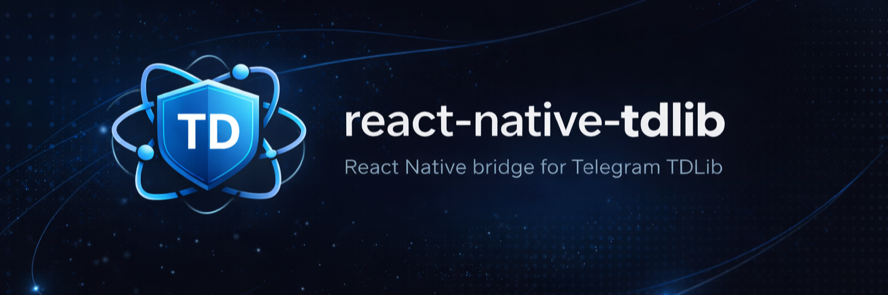

<p align="center">
  
</p>

<p align="center">
  The fastest way to build a real Telegram client in React Native.<br />
  Official <a href="https://github.com/tdlib/td">TDLib</a> under the hood, prebuilt binaries, one API on iOS and Android.
</p>

<p align="center">
  <a href="https://www.npmjs.com/package/react-native-tdlib"></a>
  <a href="https://www.npmjs.com/package/react-native-tdlib"></a>
  <a href="./LICENSE"></a>
  
</p>

---

## Why

Building a Telegram client should not start with an hour-long TDLib compile. This library ships **prebuilt** TDLib binaries for iOS (`xcframework`, device + simulator) and Android (`arm64-v8a`, `armeabi-v7a`, `x86_64`), wraps the whole API in a single RN module, and streams every update to JS through `NativeEventEmitter`.

- 🚀 **51 first-class methods** — auth, chats, messages, reactions, files, options, users.
- 🔄 **Real-time updates** — new messages, typing, read receipts, download progress, reactions.
- 🧩 **Cross-platform parity** — iOS and Android emit the same TDLib JSON shape. Write once.
- 🟦 **Fully typed** — `.d.ts` covers every method, event and result.
- 📦 **Zero native setup** — no `cmake`, no `brew install`. `pod install` and go.
- 🎬 **Ships with a Telegram-like example app** — auth wizard, chat list, message view, reactions, reply, typing.

## Install

```bash
npm install react-native-tdlib
cd ios && pod install
```

Requires React Native ≥ 0.60 (autolinking), iOS ≥ 11, Android `minSdk` ≥ 21.

## Hello, Telegram

```ts
import TdLib from 'react-native-tdlib';
import {NativeEventEmitter, NativeModules} from 'react-native';

const emitter = new NativeEventEmitter(NativeModules.TdLibModule);

// 1) Start TDLib
await TdLib.startTdLib({api_id: 12345, api_hash: 'your_hash'});

// 2) Listen for everything
emitter.addListener('tdlib-update', e => {
  if (e.type === 'updateNewMessage') {
    console.log('📨', JSON.parse(e.raw).message);
  }
});

// 3) Log in (drive via updateAuthorizationState — see docs)
await TdLib.login({countrycode: '+1', phoneNumber: '5551234567'});
await TdLib.verifyPhoneNumber('12345');

// 4) Load chats, send a message
await TdLib.loadChats(25);
const chats = JSON.parse(await TdLib.getChats(25));
await TdLib.sendMessage(chats[0].id, 'Hello from React Native!');
```

## Example app

A full Telegram-like reference client ships under [`example/`](./example): login wizard, chat list with live updates, chat view with reactions, reply, typing indicator, photo previews, pagination.

```bash
git clone https://github.com/vladlenskiy/react-native-tdlib.git
cd react-native-tdlib/example && npm install
cd ios && pod install && cd ..
npx react-native run-ios       # or run-android
```

## Documentation

- **[Getting Started →](./docs/getting-started.md)** — install, auth flow, first chat.
- **[API Reference →](./docs/api-reference.md)** — all 51 methods, grouped.
- **[Cookbook →](./docs/cookbook.md)** — practical recipes (messages, reactions, files, options, typing).
- **[Events →](./docs/events.md)** — `tdlib-update` stream, update types cheatsheet.
- **[Platform Parity →](./docs/platform-parity.md)** — how iOS and Android stay in sync.

## Contributing

Pull requests welcome. See [CONTRIBUTING.md](./docs/contributing.md) for the local workflow.

Before submitting: `npm test` must pass and the example app must build on both platforms.

## Community & support

- 🐛 **Bugs / feature requests** → [GitHub Issues](https://github.com/vladlenskiy/react-native-tdlib/issues)
- 💬 **Questions / discussion** → [GitHub Discussions](https://github.com/vladlenskiy/react-native-tdlib/discussions)
- 🐦 **Updates** → [@vladlensk1y](https://x.com/vladlensk1y) on Twitter/X
- ✉️ **Private** → vkaveev@outlook.com

## Sponsor this project

Open source takes time. If this library saves you a week of wrestling with `cmake` and TDLib internals, consider supporting development:

<p>
  <a href="https://github.com/sponsors/vladlenskiy"></a>
</p>

Sponsors are listed in the [`CHANGELOG`](./CHANGELOG.md) and on the repository homepage.

## License

[MIT](./LICENSE) © Vladlen Kaveev and contributors. TDLib itself is licensed under the Boost Software License.
